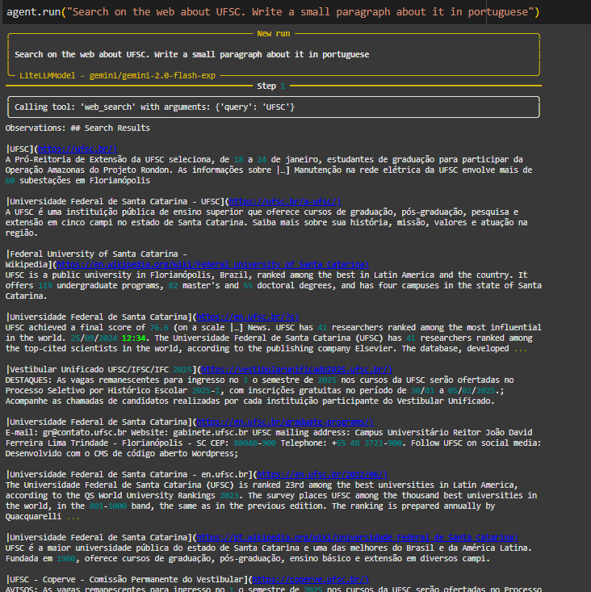
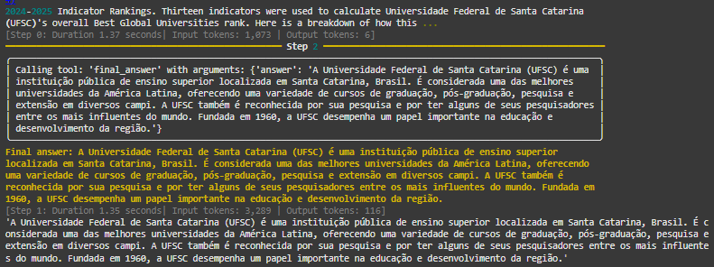
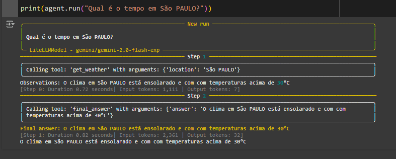
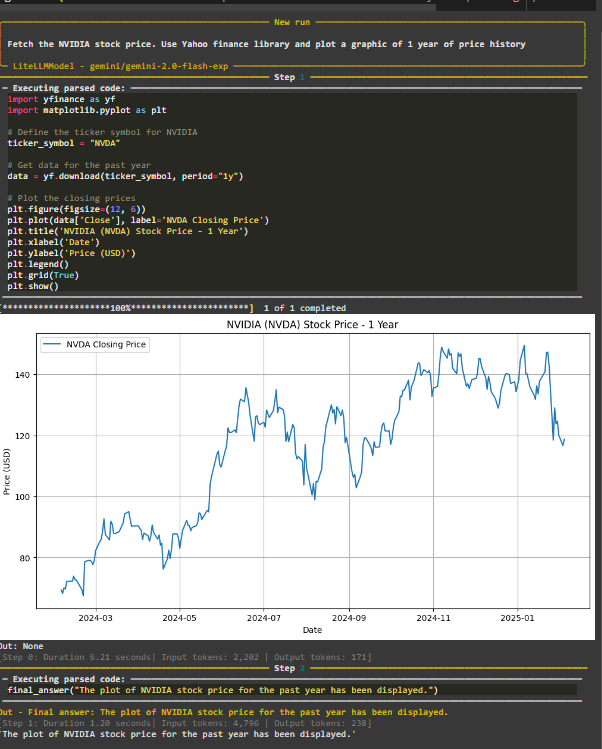

Nesse artigo busco explicar como usar a nova biblioteca de agentes do HuggingFace, chamada SmolAgents. 

Em primeiro lugar,  devemos saber o que são esses "agentes". Podemos entender que um agente é um componente que pode processar a entrada do usuário, tomar decisões e escolher as ferramentas apropriadas para cumprir uma tarefa. Ele funciona iterativamente, realizando ações até atingir uma solução.

Em nosso caso, eles utilizam o que chamamos de “tools”, ou ferramentas, que são funções com um código específico que permite ao LLM realizar ações mais complexas, como por exemplo fazer uma requisição de API, realizar cálculos matemáticos, fazer buscas na internet e executar outras tarefas.


# SmolAgents - Criando seu primeiro agente de IA

No início de 2025, o [HuggingFace](https://huggingface.co/docs/smolagents/index) lançou sua própria biblioteca de agentes com o objetivo de facilitar a vida de desenvolvedores na criação desses sistemas de IA. 
Podemos instalar a biblioteca dessa maneira: 

```
!pip install -U smolagents
```

Os códigos usados estarão em um Jupyter notebook.

Como primeiro exemplo, vamos criar um agente que faz uma busca básica na internet, usando a tool  DuckDuckGo já integrada na biblioteca. Usaremos a Gemini 2.0 Flash do google via a biblioteca  LiteLLM. Caso deseje usar outro provedor, basta inserir o nome do modelo no lugar ex: "gpt-4o-mini".

Lembre-se que uma chave de API é necessária.
Para instalar os requisitos:

```
!pip install -U langchain-community smolagents smolagents[litellm] langchain -q
```

Primeiro instanciaremos o modelo que vamos usar. Após isso criamos o agente e passamos como parâmetro as ferramentas que o agente poderá usar, nesse caso será apenas a DuckDuckGoSearchTool.

```
from smolagents import tool, LiteLLMModel ,DuckDuckGoSearchTool
from smolagents.agents import ToolCallingAgent


TOKEN = API_TOKEN

model = LiteLLMModel(model_id="gemini/gemini-2.0-flash-exp",api_key=TOKEN)

#web_agent
agent = ToolCallingAgent(tools=[DuckDuckGoSearchTool()], model=model)

agent.run("Search on the web about UFSC. Write a small paragraph about it in portuguese")
```
Resultado: 



# Crie a sua própria tool

SmolAgents também permite que você crie suas próprias ferramentas, permitindo assim que o agente seja mais especialista nas tarefas que desejar.

Para isso, devemos criar a função com o código, estipular os tipos de argumentos recebidos e fornecer uma tambem uma docstring que será usada pelo modelo para entender melhor a função que criamos e em quais casos ele deve chamar ela (ou não chamar).

Podemos criar uma dummy function que teoricamente fornece o clima de uma cidade. 
Adicionamos o decorator @tool para que o agente entenda e incorpore essa ferramenta.
Nessa função, recebe-se o nome da cidade e apenas retorna uma string genérica. Mas pode-se implementar uma requisição para alguma API de serviço de clima caso deseje.

```
@tool

def get_weather(location: str, celsius: Optional[bool] = False) -> str:

   """

   Obtém a previsão do tempo para os próximos dias no local especificado.

   Secretamente esta ferramenta não se importa com o local, ela odeia o clima em todos os lugares.

  

   Args:

       location: o local

       celsius: a temperatura

   Returns:

       str: A previsão do tempo

   """

   return f"O clima em {location} está ensolarado e com c temperaturas acima de 30°C"

agent = ToolCallingAgent(tools=[get_weather], model=model)

print(agent.run("Qual é o tempo em São Paulo?"))

```

Resultado:



# Utilizando Code Agents para automação

Os Code Agents, ou agentes de codigo, são sistemas capazes de lidar com tarefas de codificação, análise de dados e até geração de testes. Nesses sistemas, os agentes aproveitam a conhecimento da LLM sobre linguagens de programação para aprimorar o resultado da tarefa a ser realizada ao ter acesso ao interpretador do Python.

Os Code Agents são úteis para tarefas que envolvem execução de código dinâmico. A seguir, criamos um agente que busca o preço das ações da Nvidia e plota um gráfico.

Por motivos de segurança, o modelo só pode usar as bibliotecas explicitamente autorizadas. Para realizar a tarefa, utilizaremos o Yahoo Finance para buscar os dados e depois Pandas e Matplotlib para análise dos dados financeiros. Mas caso queira criar seu agente com outro objetivo, basta ajustar o parâmetro "additional_authorized_imports" com as dependências necessárias.

```
from smolagents import CodeAgent

  agent = CodeAgent(tools=[], model=model, additional_authorized_imports=["yfinance","pandas","matplotlib.pyplot"])

agent.run("Fetch the NVIDIA stock price. Use Yahoo finance library and plot a graphic of 1 year of price history")

```
Resultado: 



Assim, podemos perceber o quão fácil é criar seus próprios agentes e adaptá-los a suas próprias tarefas com a biblioteca SmolAgents.
# Fontes e saiba mais

[CODIGOOO](https://github.com/vini-muchulski/medium_artigos/blob/main/smol%20agents%20medium/smol_agents_medium.ipynb)

https://huggingface.co/docs/smolagents/v1.7.0/en/tutorials/secure_code_execution#code-agents

https://huggingface.co/docs/smolagents/v1.7.0/en/guided_tour#codeagent-and-toolcallingagent

https://github.com/huggingface/smol-course/tree/main/8_agents

[smolagents_examples/smol_multiagent.py at main · samwit/smolagents_examples](https://github.com/samwit/smolagents_examples/blob/main/smol_multiagent.py)
